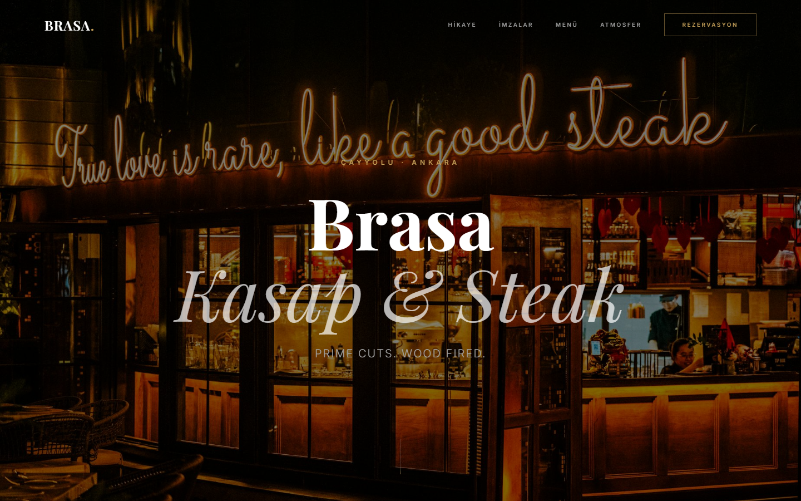
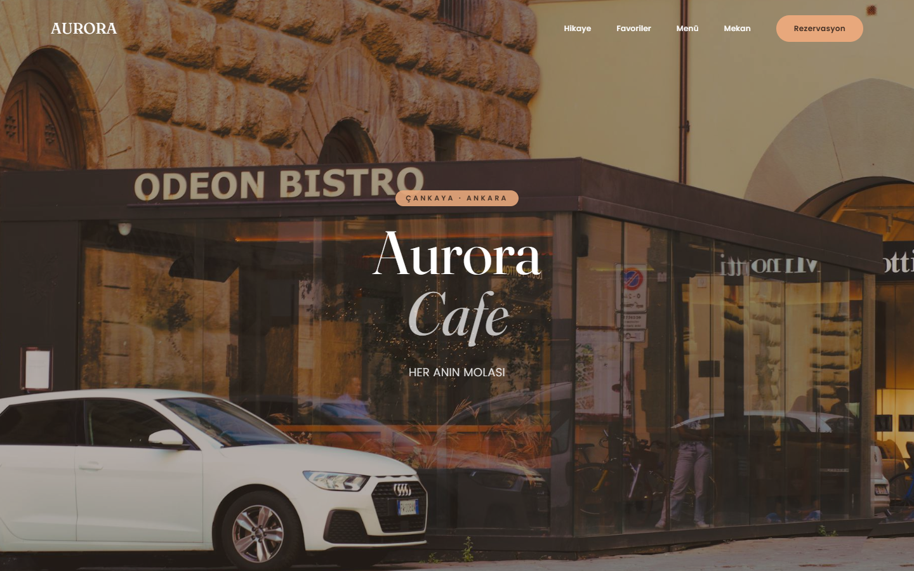
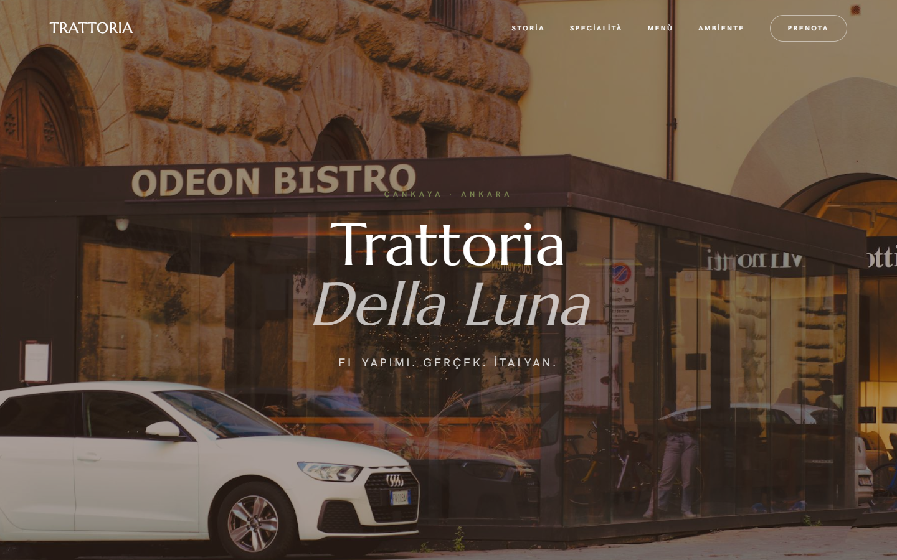
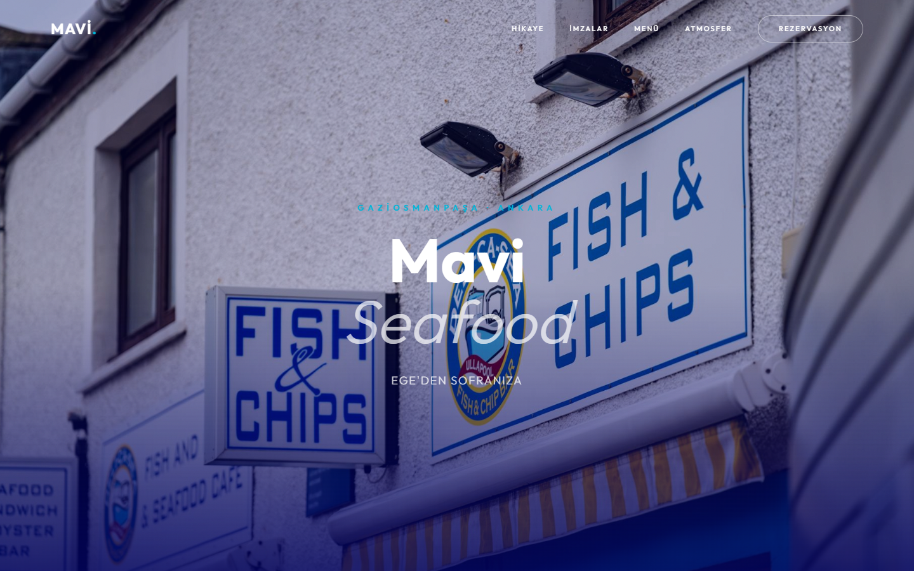
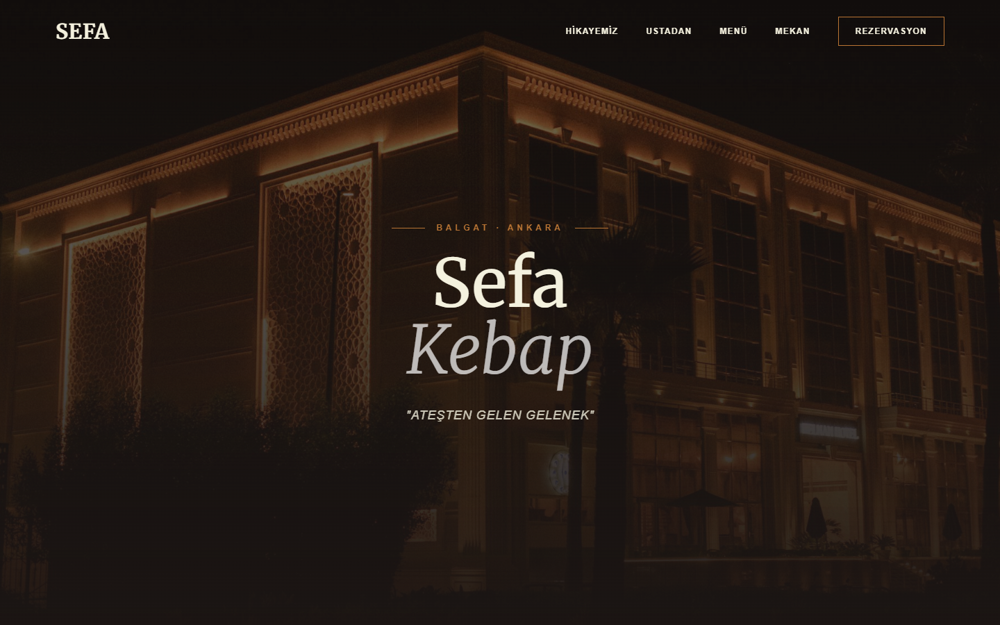

# Restaurant Demo-Site Factory

> **Showcase / vitrin reposu.** Web sitesi olmayan restoranlara **otomatik, kişiselleştirilmiş
> tanıtım sitesi üreten** bir uçtan-uca üretim hattının mimarisini, tasarım çıktılarını ve
> seçilmiş kod örneklerini sergiler. Çalışan sistemin tamamı değildir; amaç çözülen problemleri
> ve kod kalitesini göstermektir. Kaynak kod özeldir (bkz. [LICENSE](LICENSE)).
>
> _Görsellerdeki restoran adları telif/marka sorunu olmaması için kurgusaldır; gerçek
> işletmelerle ilgisi yoktur._

**Stack:** Node.js · Gemini API (içerik) · Pexels/Unsplash (görsel) · Tailwind (CDN) · Vercel API (deploy) · n8n (otomasyon)

---

## TL;DR (for reviewers)

Tek geliştirici olarak kurduğum bir **"ajans-kutuda"** otomasyon sistemi: bir restoranın adını
ver → birkaç dakikada **yayında, mobil uyumlu, içeriği ve görselleri o restorana göre üretilmiş
bir tanıtım sitesi** çıkar. Tüm hat tek komutla çalışır (`--all`).

```
Google Maps scrape → web sitesi YOK filtresi → veri ayrıştır →
Gemini ile içerik üret → mutfağa göre şablon seç → görselleri indir →
statik site derle → Vercel'e deploy → WhatsApp/e-posta ile ulaş
```

| Ne kanıtlıyor | Nerede |
|---------------|--------|
| Dış servis dayanıklılığı (çok kaynaklı yedekleme) | [Görsel indirme fallback zinciri](code-highlights/image-fallback.js) |
| API kota yönetimi (model rotasyonu + backoff) | [Gemini model fallback](code-highlights/gemini-model-fallback.js) |
| Şablon motoru (placeholder doldurma) | [Template fill](code-highlights/template-fill.js) |
| Türkçe-duyarlı metin işleme | [Slugify](code-highlights/slugify-turkish.js) |
| Pipeline / mimari kararlar | [docs/ARCHITECTURE.md](docs/ARCHITECTURE.md) |

---

## Üretilen tasarımlardan örnekler

Her mutfak türü için ayrı, elle tasarlanmış bir tema; içerik ve görseller restoran adına göre
otomatik doldurulur.

**Steakhouse teması**


| Cafe | İtalyan |
|:---:|:---:|
|  |  |
| **Seafood** | **Kebap** |
|  |  |

> Tek sayfanın tamamı (steakhouse) → [docs/screenshots/steakhouse-full.png](docs/screenshots/steakhouse-full.png)

---

## Nasıl çalışır?

1. **Scrape & filtrele** — Google Maps'ten hedef bölgedeki restoranlar çekilir; **web sitesi
   olmayan** ve puanı yüksek olanlar filtrelenir (ideal müşteri profili).
2. **İçerik üret** — Gemini API ile restorana özel slogan, "hakkımızda", imza yemekler ve menü
   metinleri üretilir (JSON şeması zorlanır). API başarısız/kota dolu ise **offline şablon
   içeriğine** düşülür → hat hiç durmaz.
3. **Tema seç** — Üretilen `theme` alanına göre 9 mutfak temasından biri seçilir (steakhouse,
   finedining, seafood, kebap, italian, cafe, meyhane, asian, vegan).
4. **Görsel topla** — Tema bazlı görseller çok kaynaklı bir zincirden indirilir
   (Pexels → Unsplash → LoremFlickr → Picsum → AI), her biri yerel klasöre kaydedilir.
5. **Derle & deploy** — Placeholder'lar doldurulur, statik site üretilir, Vercel API ile
   `{slug}.vercel.app` adresine yayınlanır.
6. **Ulaş** — Üretilen demo linki + QR ile WhatsApp/e-posta üzerinden işletmeye gönderilir.

Tüm adımlar `scripts/` altında ayrı modüller; `n8n` ile zamanlanmış otomasyona bağlanır.

---

## Mimari

Kısa özet → [docs/ARCHITECTURE.md](docs/ARCHITECTURE.md)

---

## Notlar

- Kaynak kodun tamamı özeldir; tam koda erişim **talep üzerine** (ör. teknik mülakat) sağlanabilir.
- Görsellerdeki restoran adları **kurgusaldır**; gerçek işletmelerle ilişkisi yoktur.

---

## İletişim

**Yavuz Selim Canpolat** · [LinkedIn](https://www.linkedin.com/in/yavuz-selim-canpolat-/) · [GitHub @yavuzscnplt](https://github.com/yavuzscnplt) · yavuz7500@gmail.com
